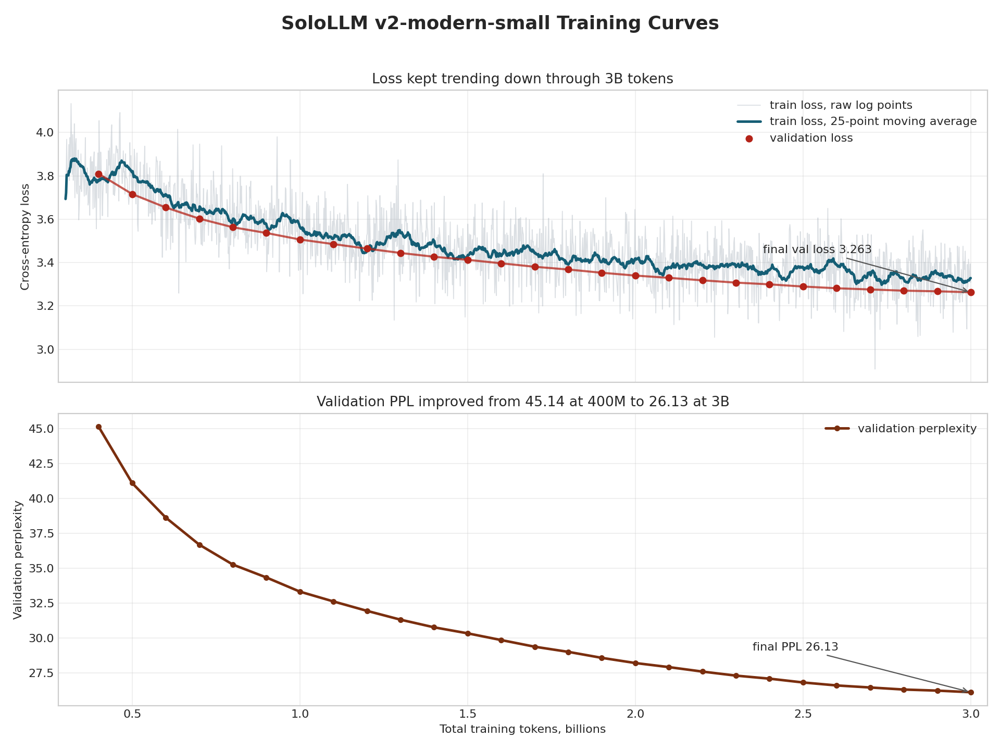

# Final 3B Modern-Small Run

Status: complete

Run directory:

```text
outputs/sologpt_v2/final_3b_modern_small_from300m
```

## Summary

| Metric | Value |
| --- | ---: |
| Variant | `v2-modern-small` |
| Parameters | 91,654,400 |
| Final total tokens | 3,000,000,512 |
| New tokens in final run | 2,699,993,088 |
| Optimizer steps | 91,554 |
| Final train loss | 3.228492259979248 |
| Best/final validation loss | 3.2631167376450465 |
| Best/final validation PPL | 26.130853370414947 |
| Validation tokens | 10,007,424 |
| Wall time | 53,932.26 sec / 14.98 hr |
| Average throughput | 50,062.67 tok/s |
| Peak GPU memory | 10.48GB |
| Hardware | single RTX 3090 |
| Finished | June 7, 2026, 6:22:57 AM AZ |

The run completed cleanly with `exit_status=0`, wrote `final_model.pt`, and sent the completion notification.

## Validation Trend

| Token point | Validation loss | Validation PPL |
| ---: | ---: | ---: |
| 400M | 3.8097405205754673 | 45.13872477627268 |
| 500M | 3.716118504116738 | 41.104536975854984 |
| 600M | 3.65418216040711 | 38.6359102135199 |
| 700M | 3.602664978772986 | 36.695898039502566 |
| 800M | 3.563031346871962 | 35.26995071458296 |
| 900M | 3.5364929315895814 | 34.346253063218924 |
| 1.0B | 3.506483082288231 | 33.33083959222747 |
| 1.5B | 3.4126904742195716 | 30.346781756911405 |
| 2.0B | 3.3400258633241156 | 28.219856555266983 |
| 2.5B | 3.289463136807766 | 26.828456578088485 |
| 2.9B | 3.2674739801513604 | 26.24496025058917 |
| 3.0B | 3.2631167376450465 | 26.130853370414947 |

The validation curve improved through the final evaluation. It was still improving, but with diminishing returns near 3B tokens.



## Full Held-Out GPT-2 Comparison

This is the full reserved test split comparison using shards `58:60` and batch size `16`, for `331,353,862` scored tokens.

| Model | Params | Train tokens | Test loss | Test PPL | Eval tokens |
| --- | ---: | ---: | ---: | ---: | ---: |
| `sologpt_v1` | 203,748,433 | 9,031,980,032 declared target, actual unverified | 3.416973299304995 | 30.477030432137123 | 331,353,862 |
| `v2-modern-small` final | 91,654,400 | 3,000,000,512 confirmed | 3.268156453091933 | 26.26287783922585 | 331,353,862 |
| `v2-modern-small` 5.60B stretch | 91,654,400 | 5,600,206,848 checkpoint metadata | 3.240833925332065 | 25.555023845683742 | 331,353,862 |
| GPT-2 small | 124,439,808 | external/public | 3.231398560029391 | 25.315036823416108 | 331,353,862 |

V1 note: the published/configured v1 target is `9,031,980,032` tokens, but no local v1 training summary was found to verify the exact completed token count. The Hugging Face safetensors checkpoint loads cleanly into the local v1 model.

Per-shard results:

| Model | Shard | Loss | PPL | Tokens |
| --- | --- | ---: | ---: | ---: |
| `sologpt_v1` | `shard_00058.pt` | 3.370535310366913 | 29.09409726185968 | 149,706,648 |
| `sologpt_v1` | `shard_00059.pt` | 3.456853917761946 | 31.71703498455639 | 149,706,648 |
| `sologpt_v1` | `shard_00060.pt` | 3.447707944220941 | 31.428274333298003 | 31,940,566 |
| `v2-modern-small` | `shard_00058.pt` | 3.2644323337206655 | 26.165253642031164 | 149,706,648 |
| `v2-modern-small` | `shard_00059.pt` | 3.273062899306841 | 26.39205187037473 | 149,706,648 |
| `v2-modern-small` | `shard_00060.pt` | 3.262614842194939 | 26.11774170461884 | 31,940,566 |
| `v2-modern-small` 5.60B stretch | `shard_00058.pt` | 3.2370785822562977 | 25.459235934639562 | 149,706,648 |
| `v2-modern-small` 5.60B stretch | `shard_00059.pt` | 3.2458324708477595 | 25.683081580106478 | 149,706,648 |
| `v2-modern-small` 5.60B stretch | `shard_00060.pt` | 3.2350069881993018 | 25.406549324258233 | 31,940,566 |
| GPT-2 small | `shard_00058.pt` | 3.2278007884586684 | 25.224122745728735 | 149,706,648 |
| GPT-2 small | `shard_00059.pt` | 3.2354433879731683 | 25.417639156262158 | 149,706,648 |
| GPT-2 small | `shard_00060.pt` | 3.2293031898009157 | 25.26204798392955 | 31,940,566 |

Interpretation:

- `v2-modern-small` is about 26% smaller than GPT-2 small by parameter count.
- The 3B checkpoint is about 55% smaller than v1 and beats v1 by about 13.8% lower perplexity on the full held-out test split.
- The 5.60B stretch checkpoint is the best v2 result: about 16.1% lower perplexity than v1 and about 2.7% lower perplexity than the 3B checkpoint.
- On the full held-out test split, the 5.60B stretch checkpoint is very close but still does not beat GPT-2: about 0.95% higher perplexity and about 0.0094 higher loss.
- This is already a strong result for the project goal because the smaller from-scratch 3090-trained model is close to GPT-2 on the same tokenized held-out data.

## Stretch Continuation Full Eval

After the 3B result, the model was continued from `outputs/sologpt_v2/final_3b_modern_small_from300m/checkpoints/latest.pt` into:

```text
outputs/sologpt_v2/stretch_5p85b_modern_small_from3b
```

The durable checkpoint evaluated here is `outputs/sologpt_v2/stretch_5p85b_modern_small_from3b/checkpoints/latest.pt`, with checkpoint metadata `tokens_total=5,600,206,848`. That matches the `ckpt_5600M.pt` checkpoint. Training later reached about `5.70B` tokens before an exit-137 stop, but no newer durable checkpoint was saved or evaluated.

This is now the same full held-out comparison as the official table above. It uses the reserved test shards, `58:60`, and scores `331,353,862` tokens. An earlier capped 10M-token eval remains saved as a quick smoke signal, but it is not the headline result.

| Model | Params | Checkpoint / train tokens | Eval tokens | Test loss | Test PPL | Eval time |
| --- | ---: | --- | ---: | ---: | ---: | ---: |
| `sologpt_v1` | 203,748,433 | Published HF checkpoint; 9,031,980,032 declared target, actual unverified | 331,353,862 | 3.416973299304995 | 30.477030432137123 | 6,833.80 sec |
| `v2-modern-small` 3B final | 91,654,400 | 3,000,000,512 confirmed | 331,353,862 | 3.268156453091933 | 26.26287783922585 | 4,885.31 sec |
| `v2-modern-small` 5.60B stretch | 91,654,400 | `latest.pt`, metadata `5,600,206,848` tokens | 331,353,862 | 3.240833925332065 | 25.555023845683742 | 5,021.90 sec |
| GPT-2 small | 124,439,808 | external/public | 331,353,862 | 3.231398560029391 | 25.315036823416108 | 6,164.70 sec |

Per-shard 5.60B stretch results:

| Model | Shard | Loss | PPL | Tokens |
| --- | --- | ---: | ---: | ---: |
| `v2-modern-small` 5.60B stretch | `shard_00058.pt` | 3.2370785822562977 | 25.459235934639562 | 149,706,648 |
| `v2-modern-small` 5.60B stretch | `shard_00059.pt` | 3.2458324708477595 | 25.683081580106478 | 149,706,648 |
| `v2-modern-small` 5.60B stretch | `shard_00060.pt` | 3.2350069881993018 | 25.406549324258233 | 31,940,566 |

Interpretation:

- The 5.60B stretch checkpoint remains about 55% smaller than v1 and about 26% smaller than GPT-2 small.
- On the full held-out eval, the 5.60B stretch checkpoint beats v1 by about `16.1%` lower perplexity and `0.1761` lower loss.
- It improves on the 3B checkpoint by about `2.7%` lower perplexity and `0.0273` lower loss.
- It still does not beat GPT-2 on this full comparison: loss gap is about `+0.0094`, and perplexity is about `+0.95%` higher.

## Robust GPT-2 Comparison Addendum

The held-out OpenWebText-style split is the main fair project comparison. To check whether that close result generalizes beyond the project split, two additional comparison layers were added for the 5.60B checkpoint:

1. automatic metrics over the fixed prompt generation suite,
2. compact external base-LM benchmarks using WikiText-2 and a capped 1,000-example LAMBADA pass.

Fixed generation metrics for `v2-modern-small` 5.60B versus GPT-2 small:

| Model | Samples | Avg tokens | Corpus distinct-1 | Corpus distinct-2 | Mean repeated bigram frac | Mean repeated trigram frac | Bad loops |
| --- | ---: | ---: | ---: | ---: | ---: | ---: | ---: |
| `v2-modern-small` 5.60B | 8 | 75.5 | 0.3907 | 0.7512 | 0.2015 | 0.1282 | 2 |
| GPT-2 small | 8 | 74.6 | 0.3869 | 0.7836 | 0.1715 | 0.1120 | 2 |

Full external benchmark results use the GPT-2 tokenizer and a shared 512-token context window:

| Benchmark | Scope | `v2-modern-small` 5.60B | GPT-2 small | Gap |
| --- | --- | ---: | ---: | ---: |
| WikiText-2 PPL | 285,618 scored tokens | 84.81 | 49.86 | v2 `+70.1%` PPL |
| LAMBADA PPL | 434,531 scored tokens / 5,153 examples | 63.03 | 42.26 | v2 `+49.2%` PPL |
| LAMBADA last-token accuracy | 5,153 examples | 44.30% | 46.67% | v2 `-2.37` points |
| LAMBADA last-word greedy exact | 5,153 examples | 29.09% | 32.60% | v2 `-3.51` points |

Full multiple-choice continuation scoring uses conditional log-likelihood with a shared 512-token context window. `Accuracy norm` is the primary metric because it normalizes by continuation length:

| Benchmark | Examples | `v2-modern-small` 5.60B acc norm | GPT-2 small acc norm | Gap |
| --- | ---: | ---: | ---: | ---: |
| HellaSwag | 10,042 | 26.99% | 29.53% | v2 `-2.54` points |
| PIQA | 1,000 | 61.00% | 63.60% | v2 `-2.60` points |
| ARC-Easy | 570 | 37.89% | 40.35% | v2 `-2.46` points |
| ARC-Challenge | 299 | 19.73% | 22.07% | v2 `-2.34` points |
| WinoGrande | 1,267 | 49.25% | 49.72% | v2 `-0.47` points |

Interpretation:

- On the project held-out split, v2 is genuinely close to GPT-2 small: about `0.95%` higher perplexity.
- On external corpora, GPT-2 is more robust. The gap is much larger on WikiText-2 and LAMBADA perplexity.
- LAMBADA token/word accuracy is closer than external perplexity, but GPT-2 still leads.
- GPT-2 leads every length-normalized multiple-choice check, though those gaps are much smaller than the external perplexity gaps.
- The best honest conclusion is that v2 approaches GPT-2 on the in-domain held-out comparison, but it does not match GPT-2 across the board.

## Artifacts

| Artifact | Path |
| --- | --- |
| Final model | `outputs/sologpt_v2/final_3b_modern_small_from300m/final_model.pt` |
| Latest checkpoint | `outputs/sologpt_v2/final_3b_modern_small_from300m/checkpoints/latest.pt` |
| Metrics JSONL | `outputs/sologpt_v2/final_3b_modern_small_from300m/metrics.jsonl` |
| Training summary | `outputs/sologpt_v2/final_3b_modern_small_from300m/metrics_summary.json` |
| v2 capped test eval | `outputs/sologpt_v2/final_3b_modern_small_from300m/eval_v2_test_10m.json` |
| GPT-2 capped test eval | `outputs/sologpt_v2/final_3b_modern_small_from300m/eval_gpt2_test_10m.json` |
| v1 full test eval | `outputs/sologpt_v2/final_3b_modern_small_from300m/eval_v1_test_full.json` |
| v2 full test eval | `outputs/sologpt_v2/final_3b_modern_small_from300m/eval_v2_test_full.json` |
| GPT-2 full test eval | `outputs/sologpt_v2/final_3b_modern_small_from300m/eval_gpt2_test_full.json` |
| Phase 4 eval log | `outputs/sologpt_v2/final_3b_modern_small_from300m/phase4_full_eval.log` |
| Phase 4 v1 eval log | `outputs/sologpt_v2/final_3b_modern_small_from300m/phase4_v1_eval.log` |
| Stretch checkpoint latest | `outputs/sologpt_v2/stretch_5p85b_modern_small_from3b/checkpoints/latest.pt` |
| Stretch capped v1 eval | `outputs/sologpt_v2/stretch_5p85b_modern_small_from3b/eval_v1_test_10m.json` |
| Stretch capped v2 eval | `outputs/sologpt_v2/stretch_5p85b_modern_small_from3b/eval_v2_5p6b_test_10m.json` |
| Stretch capped GPT-2 eval | `outputs/sologpt_v2/stretch_5p85b_modern_small_from3b/eval_gpt2_test_10m.json` |
| Stretch capped eval log | `outputs/sologpt_v2/stretch_5p85b_modern_small_from3b/stretch_eval_10m.log` |
| Stretch full v2 eval | `outputs/sologpt_v2/stretch_5p85b_modern_small_from3b/eval_v2_5p6b_test_full.json` |
| Stretch full eval log | `outputs/sologpt_v2/stretch_5p85b_modern_small_from3b/phase4_full_eval_5p6b_v2.log` |
| Generation prompt suite | `eval/phase4_prompts.json` |
| Generation samples JSON | `outputs/sologpt_v2/final_3b_modern_small_from300m/phase4_generations.json` |
| Generation samples report | `docs/results/phase4_generations.md` |
| Stretch v2/GPT-2 generation samples JSON | `outputs/sologpt_v2/stretch_5p85b_modern_small_from3b/phase4_generations_5p6b_v2_gpt2.json` |
| Stretch v2/GPT-2 generation samples report | `docs/results/phase4_generations_5p6b_v2_gpt2.md` |
| Stretch v2/GPT-2 generation metrics JSON | `outputs/sologpt_v2/stretch_5p85b_modern_small_from3b/phase4_generation_metrics_5p6b_v2_gpt2.json` |
| Stretch v2/GPT-2 generation metrics report | `docs/results/phase4_generation_metrics_5p6b_v2_gpt2.md` |
| Stretch v2/GPT-2 external benchmarks JSON | `outputs/sologpt_v2/stretch_5p85b_modern_small_from3b/external_benchmarks_5p6b_v2_gpt2.json` |
| Stretch v2/GPT-2 external benchmarks report | `docs/results/external_benchmarks_5p6b_v2_gpt2.md` |
| Stretch v2/GPT-2 full external benchmarks JSON | `outputs/sologpt_v2/stretch_5p85b_modern_small_from3b/external_benchmarks_5p6b_v2_gpt2_full.json` |
| Stretch v2/GPT-2 full external benchmarks report | `docs/results/external_benchmarks_5p6b_v2_gpt2_full.md` |
| Stretch v2/GPT-2 full multiple-choice JSON | `outputs/sologpt_v2/stretch_5p85b_modern_small_from3b/multiple_choice_5p6b_v2_gpt2_full.json` |
| Stretch v2/GPT-2 full multiple-choice report | `docs/results/multiple_choice_5p6b_v2_gpt2_full.md` |
| Stretch v2/GPT-2 full diagnostic report | `docs/results/v2_gpt2_full_diagnostic.md` |
| Generation metrics CLI | `eval/generation_metrics.py` |
| External benchmark CLI | `eval/external_benchmarks.py` |
| Multiple-choice benchmark CLI | `eval/multiple_choice_benchmarks.py` |

## Qualitative Generation

The fixed prompt suite generated raw samples for v1, v2, and GPT-2 using:

- seed `1337`,
- temperature `0.8`,
- top-k `40`,
- max new tokens `80`,
- the GPT-2 tokenizer for all models.

Qualitative read:

- v2 is generally less repetitive and more fluent than v1.
- v2 still shows base-LM weaknesses: factual drift, weak code completion, and occasional unstable continuations.
- GPT-2 remains more coherent overall in the raw sample suite.
- The 5.60B v2/GPT-2 generation metrics are close on distinct-token diversity, while GPT-2 has slightly lower repeated bigram/trigram rates.
- The generation result matches the broader evaluation result: v2 clearly improves over v1 and gets close to GPT-2 on the project split, but GPT-2 remains stronger overall.

## Decision

The model completed the main Phase 4 held-out perplexity comparison and fixed generation sample pass.

The remaining v2 work is packaging, not experimentation:

1. Keep the final README/project-brief result tables current.
2. Treat dataset/tokenizer/model-size changes as v3 work.

More training is plausible because validation was still improving, but it should now be treated as v3. The current v2 result is already a complete project outcome: a much smaller model than v1 that beats v1 clearly, gets within about 1% of GPT-2 small on the project held-out test, and documents that GPT-2 remains stronger on broader external checks.

The v2-to-v3 gap analysis is documented in `docs/V3_PLAN.md`.
